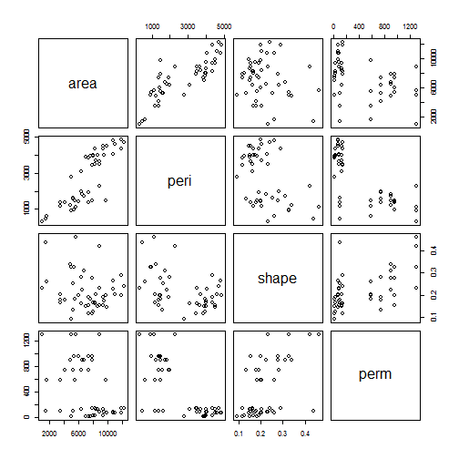

Course Project Data Products
========================================================
author:  Mark Cockerham
date: Sept 23, 2015

Shiny Simple Linear Model
========================================================

This tool is composed of 5 key sections.  The first is the side panel that
allows you to select what we will be looking at, the 2nd is the following tabs.
 
- Summary 
- View
- Cor 
- LM

We will take a quick look at what the selections in the side panel do and sample outputs for
the cor and Linear Model tabs.   This tool allows for a quick and simple way to preform linear regression and get a
quick look at a data set.

selections
========================================================


By simpley selecting the data set, the columns one wishes to look at all the basics are done for you for a quick linear regression.

To help out even before the column selection is done you can look at.

In the Summary Tab the range of values in each column

In the Summary Tab what data are we looking at

In the Cor tab a clear understanding of how each column relates to every other column in the data set.

And lastly in the LM Tab what is the linear relationship between these variables.

  

Cor 
========================================================

Lets look a bit closer at the Cor Tab.

In the Cor tab a clear understanding of how each column relates to every other column in the data set.


```r
plot(rock)
```

 


LM
========================================================
And lastly what the linear regression would look like if we select the rock data set and the peri and shape columsn for our model 


```r
    model <- lm(rock[,2] ~ rock[,3]) 
    summary(model)
```

```

Call:
lm(formula = rock[, 2] ~ rock[, 3])

Residuals:
     Min       1Q   Median       3Q      Max 
-2284.67  -930.20   -12.55   981.70  2436.75 

Coefficients:
            Estimate Std. Error t value Pr(>|t|)    
(Intercept)   4302.0      531.5   8.095 2.15e-10 ***
rock[, 3]    -7426.5     2278.7  -3.259  0.00211 ** 
---
Signif. codes:  0 '***' 0.001 '**' 0.01 '*' 0.05 '.' 0.1 ' ' 1

Residual standard error: 1304 on 46 degrees of freedom
Multiple R-squared:  0.1876,	Adjusted R-squared:  0.1699 
F-statistic: 10.62 on 1 and 46 DF,  p-value: 0.002105
```
